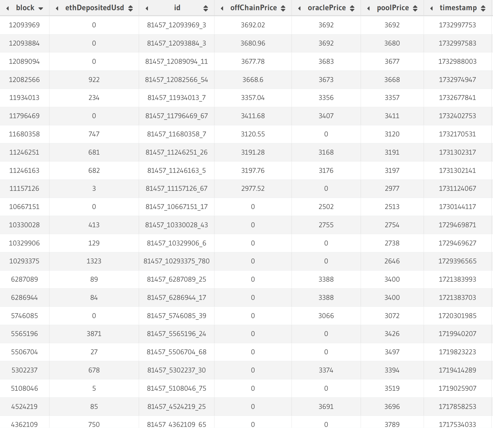

# Getting price data in your indexer

TLDR, the code for this guide can be found [here](todo add link)

There are many applications where you may want to get price data in your indexer. For example, you may want to use price data to calculate the value of historical token transfers or the TVL of a Uniswap pool over time. However, the relevant events to be indexed may not contain the price data you need. In this case, we have 3 different way to get price data inside the indexer:

1. Oracles
2. Dex pools
3. Offchain API

Each of these methods has its own pros and cons and we will analyze each through the metrics of accuracy, centralization, and data availability. We will also go through each of these methods and explain how to use them in a simple indexer to get the USD value ETH deposits into a Uniswap V3 liquidity pool. We will be using the [Blast](https://blastscan.io/) blockchain however the same principles apply to any other EVM blockchain.

## Oracles

Oracles are a type of service that provide offchain data to the blockchain. This is usually price-data but has no limitations and can be anything from odds for a sports-betting dApp to random numbers which can be used for a lottery. One such oracle which we will use here is [API3](https://api3.org/) which currently only focuses on price feeds.

To find the relevant ETH/USD price update events using API3: 

- The events we care about are emitted on the Api3ServerV1 contract at [0x709944a48cAf83535e43471680fDA4905FB3920a](https://github.com/api3dao/contracts/blob/main/deployments/blast/Api3ServerV1.json#L2) on Blast, which you can find in the `@api3/contracts`. The events are emitted with data feed IDs and not [dAPI](https://api3.org/data-feeds/) names, so we need to look up what data feed ID the particular dAPI name is set to. 'dAPI' just refers to API3's price data feeds.

1. `"ETH/USD"` (the dAPI name) as a `bytes32` string is `0x4554482f55534400000000000000000000000000000000000000000000000000`
2. Using the [dapiNameToDataFeedId](https://blastscan.io/address/0x709944a48cAf83535e43471680fDA4905FB3920a#readContract#F8) conversion function, we see the dAPI is set to a data feed ID with `0x3efb3990846102448c3ee2e47d22f1e5433cd45fa56901abe7ab3ffa054f70b5`
3. Searching using ctrl-f `0x3efb3990846102448c3ee2e47d22f1e5433cd45fa56901abe7ab3ffa054f70b5` in on the [contract events tab](https://blastscan.io/address/0x709944a48cAf83535e43471680fDA4905FB3920a#events), we see some `UpdatedBeaconSetWithBeacons` events with our ETH/USD data feed, which is what we're looking for. Note that the prices are stored as `int224` values. More on that later.

Don't worry about the above steps too much as each oracle service will have it's own contracts and events. Just read their documentation or reach out for help on their Discord and you should be able to find the relevant information.

### Oracle considerations

- **Accuracy**: Due to gas prices, oracles don't push onchain price updates constantly.  Instead, as with API3, the oracle normally only pushes an onchain update at certain price deviations, e.g. 1% or 5%. This means that the latest price pushed from the oracle will not always be the most recent price, although it should be close.
- **Centralization**: This will vary from oracle to oracle. API3 runs price feeds from their own API's which means they have a higher degree of centralization. However, this allows them to provide a higher level of security and trustworthiness. Chainlink lets anyone run their own node and provide their own price feeds, which means they are more decentralized. There are some trustworthiness concerns associated with this decentralization but they have reputation and punishment mechanisms as a mitigation.
- **Data availability**: For security reasons, oracles often choose to limit the price feeds they support to pairs with high liquidity, volume, and trustworthiness. This means that you may not be able to get price data for all tokens, especially newer, low marketcap tokens.

In terms using oracle price feeds in your indexer, you will have to rely on the latest price pushed onchain, which may not be accurate to a certain deviation. However, this is very fast as you can get the price data directly from the event without any API calls. Use this if speed of indexing is more important than accuracy.

## Dex pools

Dex pools are a type of smart contract that allows users to swap tokens with each other. Uniswap is the most popular dex and has a large number of tokens listed on many chains, including on Blast. The main stable coin on Blast is USDB at `0x4300000000000000000000000000000000000003` while WETH is at `0x4300000000000000000000000000000000000004`. To get the Uniswap pool address programmically, we can use the following script:

> src/getUniswapPool.ts

:::info
You can also manually use the `getPool` function on [blastscan](https://blastscan.io/address/0x792edAdE80af5fC680d96a2eD80A44247D2Cf6Fd#readContract#F2) to arrive at the same result.
:::

```typescript
import { createPublicClient, http, parseAbi, getContract } from 'viem';
import { blast } from 'viem/chains';

const usdb = '0x4300000000000000000000000000000000000003';
const weth = '0x4300000000000000000000000000000000000004';
const factoryAddress = '0x792edAdE80af5fC680d96a2eD80A44247D2Cf6Fd';
const factoryAbi = parseAbi(["function getPool( address tokenA, address tokenB, uint24 fee ) external view returns (address pool)"]);

const providerUrl = 'https://rpc.ankr.com/blast'; 
const poolBips = 3000;  // 0.3%. This is measured in hundredths of a bip

const client = createPublicClient({
    chain: blast,
    transport: http(providerUrl),
});

const factoryContract = getContract({
    abi: factoryAbi,
    address: factoryAddress,
    client: client,
});

(async () => {
    const poolAddress = await factoryContract.read.getPool([usdb, weth, poolBips]);
    console.log(poolAddress);
})();
```

The resulting pool address for USDB/WETH is `0xf52B4b69123CbcF07798AE8265642793b2E8990C`. You can use this address to get the price data from the dex pool. The relevant event for Uniswap v3 pools is the `Swap` event which contains the price data in the `sqrtPriceX96` field. To convert this to a price, there is a simple calculation that needs to be made which you can see in the [event handler](#event-handler) section.

### DEX pool considerations

- **Accuracy**: Dex pools rely on arbitraguers to keep prices in line with the market. For high liquidity pools, this is usually not a problem and the price can be taken to be reliable, with rare exception. However, for low liquidity pools, the price can change drastically with a single trade and the incentive for arbitraguers to keep the price in line is lower, which can lead to price manipulation. This means that the price you get from a dex pool may not be the same as the price you would get on a centralized exchange.
- **Centralization**: The price you get from a dex pool cannot be controlled by any single entity and is therefore more decentralized than an oracle. However, price manipulation is a risk as aforementioned.
- **Data availability**: Popular dexs have a lot of tokens listed and using the dex pool events you can get the price feeds for most, if not all tokens listed on the dex. However, not all tokens, will be in a pool be in a pool with a stable coin such as USDC. For example, on Ethereum, many newer tokens are only listed in pools with ETH. In this case, you would have to follow a two step process to get the price of the token in USD: First, get the price of the token in ETH and then get the price of ETH in a stablecoin. Also note that stablecoins are not totally 1:1 with the US dollar and do occasionally from their peg, although this is rare and can be ignored in most cases, especially with trusted stablecoins like USDC, USDT, and DAI.

As with oracles, using dex pool price data in your indexer will be very fast as you can get the price data directly from the event without any API calls. However, you will have to rely on the value of the latest swap which may not be totally accurate, especially for low marketcap tokens. Use this if speed of indexing is more important than accuracy. Choosing between dex pools and oracles will depend on the specific use case of your indexer, dex pools will typically have more swap events than oracles will push price updates, so may be more up to date, but are more susceptible to manipulation.

## Offchain API

Offchain APIs, which typically use the [REST API](https://www.ibm.com/topics/rest-apis) framework, are the most reliable way to get price data as they are run by centralized entities that have the resources to provide completely accurate and up-to-date price data. One such API is [CoinGecko](https://www.coingecko.com/en/api). CoinGecko provides price data for the majority of tokens on the blockchain with real volume. However there are several downsides as API calls are very slow and getting [historical prices](https://docs.noves.fi/reference/get_evm-chain-price-tokenaddress) that are accurate to the block from an API will typically require a paid subscription. [Coingecko's fee tier API](https://docs.coingecko.com/v3.0.1/reference/coins-id-history) allows us to get the historical price, although it can only return the token price at the start of that day i.e. 00:00:00 UTC. As we don't have a paid subscription to get historical prices accurate to the block, we will use CoinGecko's free API to give us a rough estimate of the price of ETH in USD at a certain block. We don't expect this to be completely accurate and include it for demonstration purposes only.

> src/request.ts

:::info
If you are following along with the demo, get your own CoinGecko API key [here](https://www.coingecko.com/en/developers/dashboard) and set it as an environment variable.
:::

```typescript
const COIN_GECKO_API_KEY = process.env.COIN_GECKO_API_KEY;

async function fetchEthPriceFromUnix(unix: number, token = "ethereum"): Promise<any> {
    // convert unix to date dd-mm-yyyy
    const _date = new Date(unix * 1000);
    const date = _date.toISOString().slice(0, 10).split("-").reverse().join("-");
    console.log(date);
    return fetchEthPrice(date.slice(0, 10), token);
}

async function fetchEthPrice(date: string, token = "ethereum"): Promise<any> {
    const options = {
        method: 'GET',
        headers: { accept: 'application/json', 'x-cg-demo-api-key': COIN_GECKO_API_KEY }
    };

    return fetch(`https://api.coingecko.com/api/v3/coins/${token}/history?date=${date}&localization=false`, options as any)
        .then(res => res.json())
        .then((res: any) => res.market_data.current_price.usd)
        .catch(err => console.error(err));
}

export default fetchEthPriceFromUnix;
```

### Offchain API considerations

- **Accuracy**: If using an endpoint that is accurate to the block, this is the most accurate and reliable to get price data in your indexer as most services, including CoinGecko, aggregate price data from many different sources so price feed manipulation is highly unlikely. The only real risk you run is if the API goes down or sufferes manipulation, which is very rare for reputable APIs.
- **Centralization**: Offchain APIs are typically controlled by a single entity meaning they are very centralized. This means that you have to trust the API to provide accurate and reliable price data. However, as mentioned, reputable APIs are very unlikely to manipulate price data and this is not a concern for most users.
- **Data availability**: Offchain APIs such as CoinGecko provide price feeds for the majority of tokens on the blockchain with real volume. However, they may not have price data for newer, low marketcap tokens. In that case, you may have to rely on dex pools or oracles to get price data. Note that offchain APIs require an api call every time you need price data which will **significantly** slow down your indexer. API calls will change your indexer from a fast, event-based indexer to a slow, call-based indexer that may take hours to run.

Due to the slow nature of rest API calls and the fact that you may need a paid subscription, only use this method if accuracy is of the utmost importance. This will help to speed up your indexer and reduce the cost of API calls.

## Event handler

To compare these methods, we will compare the values of the USDB/WETH pool on Uniswap v3 after every `Mint` event.

`npx envio init`

- For our oracle information, `0x709944a48cAf83535e43471680fDA4905FB3920a` contract and the `UpdatedBeaconSetWithBeacons` event.
- For our dex pool and tvl information, `0xf52B4b69123CbcF07798AE8265642793b2E8990C` contract and the `Swap` and `Mint` event.

> config.yaml

```yaml
# yaml-language-server: $schema=./node_modules/envio/evm.schema.json
name: envio-indexer
networks:
- id: 81457
  start_block: 11000000
  contracts:
  - name: Api3ServerV1
    address:
    - 0x709944a48cAf83535e43471680fDA4905FB3920a
    handler: src/EventHandlers.ts
    events:
    - event: UpdatedBeaconSetWithBeacons(bytes32 indexed beaconSetId, int224 value, uint32 timestamp)
  - name: UniswapV3Pool
    address:
    - 0xf52B4b69123CbcF07798AE8265642793b2E8990C
    handler: src/EventHandlers.ts
    events:
    - event: Swap(address indexed sender, address indexed recipient, int256 amount0, int256 amount1, uint160 sqrtPriceX96, uint128 liquidity, int24 tick)
    - event: Mint(address sender, address indexed owner, int24 indexed tickLower, int24 indexed tickUpper, uint128 amount, uint256 amount0, uint256 amount1)
rollback_on_reorg: false
field_selection:
  transaction_fields:
    - "hash"
```

> schema.graphql

:::info
We have simiflied the default schema to only include the relevant values. Basically we only care about the price and the timestamp or blocknumber.
:::

```graphql
type OraclePoolPrice {
  id: ID!
  value: BigInt!
  timestamp: BigInt!
  block: Int!
}

type UniswapV3PoolPrice {
  id: ID!
  sqrtPriceX96: BigInt!
  timestamp: Int!
  block: Int!
}

type EthDeposited {
  id: ID!
  timestamp: Int!
  block: Int!
  oraclePrice: BigInt!
  poolPrice: BigInt!
  ethDepositedUsd: Float!
  usdDeposited: Float!
  offChainPrice: Float!
  txHash: String!
}
```

> src/EventHandlers.ts

```typescript
import {
  Api3ServerV1,
  OraclePoolPrice,
  UniswapV3Pool,
  UniswapV3PoolPrice,
  EthDeposited,
} from "generated";
import fetchEthPriceFromUnix from "./request";

let latestOraclePrice = 0n;
let latestPoolPrice = 0n;

Api3ServerV1.UpdatedBeaconSetWithBeacons.handler(async ({ event, context }) => {
  const entity: OraclePoolPrice = {
    id: `${event.chainId}-${event.block.number}-${event.logIndex}`,
    value: event.params.value,
    timestamp: event.params.timestamp,
    block: event.block.number,
  };

  latestOraclePrice = event.params.value / BigInt(10 ** 18);

  context.OraclePoolPrice.set(entity);
});

UniswapV3Pool.Swap.handler(async ({ event, context }) => {
  const entity: UniswapV3PoolPrice = {
    id: `${event.chainId}-${event.block.number}-${event.logIndex}`,
    sqrtPriceX96: event.params.sqrtPriceX96,
    timestamp: event.block.timestamp,
    block: event.block.number,
  };

  latestPoolPrice = BigInt(2 ** 192) / (BigInt(event.params.sqrtPriceX96) * BigInt(event.params.sqrtPriceX96));

  context.UniswapV3PoolPrice.set(entity);
});

UniswapV3Pool.Mint.handler(async ({ event, context }) => {

  const offChainPrice = await fetchEthPriceFromUnix(event.block.timestamp);

  const ethDepositedUsd = latestPoolPrice * event.params.amount1 / BigInt(10 ** 18);

  const EthDeposited: EthDeposited = {
    id: `${event.chainId}_${event.block.number}_${event.logIndex}`,
    timestamp: event.block.timestamp,
    block: event.block.number,
    oraclePrice: latestOraclePrice,
    poolPrice: latestPoolPrice,
    offChainPrice: Number(offChainPrice.toFixed(2)),
    ethDepositedUsd: Number(ethDepositedUsd),
    usdDeposited: Number(event.params.amount0/BigInt(10**18)),
    txHash: event.transaction.hash,
  }


  context.EthDeposited.set(EthDeposited);
});
```

## Analysis

The main point of comparison is between the `oraclePrice` and the `poolPrice` as the `offChainPrice` is only accurate to the day as explained in the [offchain](#offchain-api) section. It is evident that the two prices are typically very close to each other. However, sometimes the oracle price is bad, i.e. it has a value of `0`. The DEX price can never be that bad as it will always be arbitraged to the somewhat correct price.

We have included the transaction hashes for you to cross check the prices on [Blastscan](https://blastscan.io/). For example, for [this](https://blastscan.io/tx/0xe7e79ddf29ed2f0ea8cb5bb4ffdab1ea23d0a3a0a57cacfa875f0d15768ba37d) transaction (last row in the image), BlastScan shows an Ethereum value of $2,289.37 deposited, which we can assume to be correct. Our value shows $2,117, showing that the dex price does not yield completely accurate results, but only an approximation.

In conclusion, use an offchain API if you need the most accurate price data, otherwise consider using oracle or dex pool events.

