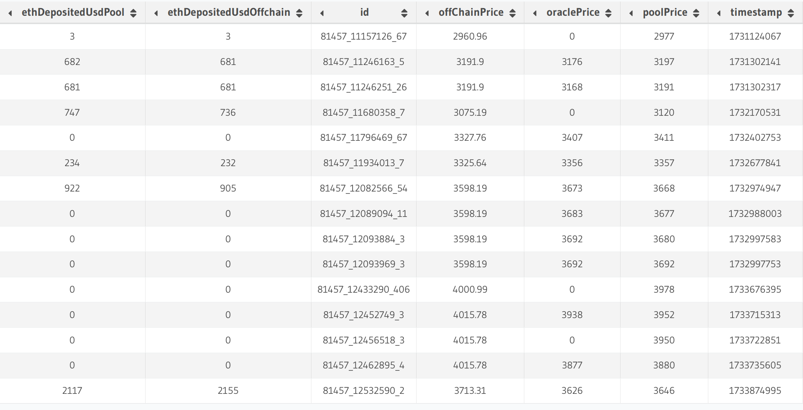

# Getting Price Data in Your Indexer

## Introduction

Many blockchain applications require price data to calculate values such as:

- Historical token transfer values in USD
- Total value locked (TVL) in DeFi protocols over time
- Portfolio valuations at specific points in time

This tutorial explores three different approaches to incorporating price data into your Envio indexer, using a real-world example of tracking ETH deposits into a Uniswap V3 liquidity pool on the Blast blockchain.

> **TL;DR:** The complete code for this tutorial is available in [this GitHub repository](https://github.com/enviodev/price-data).

## What You'll Learn

In this tutorial, you'll:

- Compare three different methods for accessing token price data
- Analyze the tradeoffs between accuracy, decentralization, and performance
- Implement a multi-source price feed in an Envio indexer
- Build a practical example indexing Uniswap V3 liquidity events with price context

## Price Data Methods Compared

There are three primary methods to access price data within your indexer:

| Method         | Description                                  | Speed | Accuracy    | Decentralization |
| -------------- | -------------------------------------------- | ----- | ----------- | ---------------- |
| Oracles        | On-chain price feeds (e.g., API3, Chainlink) | Fast  | Medium      | Medium           |
| DEX Pools      | Swap events from decentralized exchanges     | Fast  | Medium-High | High             |
| Off-chain APIs | External services (e.g., CoinGecko)          | Slow  | High        | Low              |

Let's explore each method in detail.

## Method 1: Using Oracle Price Feeds

Oracle networks provide on-chain price data through specialized smart contracts. For this tutorial, we'll use [API3](https://api3.org/) price feeds on Blast.

### How Oracles Work

Oracle services like API3 maintain a network of data providers that push price updates to on-chain contracts. These updates typically occur:

- At regular time intervals
- When price deviations exceed a predefined threshold (e.g., 1%)
- When manually triggered by network participants

### Finding the Right Oracle Feed

To locate the ETH/USD price feed using API3 on Blast:

1. Identify the API3 contract address: [`0x709944a48cAf83535e43471680fDA4905FB3920a`](https://blastscan.io/address/0x709944a48cAf83535e43471680fDA4905FB3920a)

2. Find the data feed ID for ETH/USD:

   - The dAPI name "ETH/USD" as bytes32: `0x4554482f55534400000000000000000000000000000000000000000000000000`
   - Using the [`dapiNameToDataFeedId`](https://blastscan.io/address/0x709944a48cAf83535e43471680fDA4905FB3920a#readContract#F8) function, this maps to `0x3efb3990846102448c3ee2e47d22f1e5433cd45fa56901abe7ab3ffa054f70b5`

3. Monitor the `UpdatedBeaconSetWithBeacons` events with this data feed ID to get price updates

### Oracle Advantages and Limitations

**Advantages:**

- Fast indexing (no external API calls required)
- Moderate decentralization
- Generally reliable data

**Limitations:**

- Updates only on significant price changes
- Limited token coverage (mainly high-liquidity pairs)
- Minor accuracy tradeoffs

## Method 2: Using DEX Pool Swap Events

Decentralized exchanges like Uniswap provide price data through swap events. We'll use the USDB/WETH pool on Blast to derive ETH pricing.

### Locating the Right DEX Pool

First, we need to find the specific Uniswap V3 pool for USDB/WETH:

```typescript
import { createPublicClient, http, parseAbi, getContract } from "viem";
import { blast } from "viem/chains";

const usdb = "0x4300000000000000000000000000000000000003";
const weth = "0x4300000000000000000000000000000000000004";
const factoryAddress = "0x792edAdE80af5fC680d96a2eD80A44247D2Cf6Fd";
const factoryAbi = parseAbi([
  "function getPool( address tokenA, address tokenB, uint24 fee ) external view returns (address pool)",
]);

const providerUrl = "https://rpc.ankr.com/blast";
const poolBips = 3000; // 0.3%. This is measured in hundredths of a bip

const client = createPublicClient({
  chain: blast,
  transport: http(providerUrl),
});

const factoryContract = getContract({
  abi: factoryAbi,
  address: factoryAddress,
  client: client,
});

(async () => {
  const poolAddress = await factoryContract.read.getPool([
    usdb,
    weth,
    poolBips,
  ]);
  console.log(poolAddress);
})();
```

> **Tip:** You can also manually find the pool address using the [`getPool`](https://blastscan.io/address/0x792edAdE80af5fC680d96a2eD80A44247D2Cf6Fd#readContract#F2) function on a block explorer.

Running this code reveals the USDB/WETH pool is at [`0xf52B4b69123CbcF07798AE8265642793b2E8990C`](https://blastscan.io/address/0xf52B4b69123CbcF07798AE8265642793b2E8990C).

### Getting Price Data From Swap Events

Uniswap V3 emits `Swap` events containing price information in the `sqrtPriceX96` field. To convert this to a price, we'll use a formula in our event handler.

### DEX Advantages and Limitations

**Advantages:**

- Very decentralized
- High update frequency
- Wide token coverage

**Limitations:**

- Susceptible to price impact and manipulation (especially in low-liquidity pools)
- Requires extra calculations to derive prices
- May require multiple pools for cross-pair calculations

## Method 3: Using Off-chain APIs

External price APIs like [CoinGecko](https://www.coingecko.com/en/api) provide comprehensive token price data but require HTTP calls from your indexer.

### Making API Requests

Here's a simple function to fetch historical ETH prices from CoinGecko:

```typescript
const COIN_GECKO_API_KEY = process.env.COIN_GECKO_API_KEY;

async function fetchEthPriceFromUnix(
  unix: number,
  token = "ethereum"
): Promise<number> {
  // convert unix to date dd-mm-yyyy
  const _date = new Date(unix * 1000);
  const date = _date.toISOString().slice(0, 10).split("-").reverse().join("-");
  return fetchEthPrice(date.slice(0, 10), token);
}

async function fetchEthPrice(
  date: string,
  token = "ethereum"
): Promise<number> {
  const options = {
    method: "GET",
    headers: {
      accept: "application/json",
      "x-cg-demo-api-key": COIN_GECKO_API_KEY,
    },
  };

  return fetch(
    `https://api.coingecko.com/api/v3/coins/${token}/history?date=${date}&localization=false`,
    options as any
  )
    .then((res) => res.json())
    .then((res: any) => {
      const usdPrice = res.market_data.current_price.usd;
      console.log(`ETH price on ${date}: ${usdPrice}`);
      return usdPrice;
    })
    .catch((err) => console.error(err));
}

export default fetchEthPriceFromUnix;
```

> **Note:** The free CoinGecko API only provides daily price data (at 00:00 UTC), not block-by-block precision. For production use, consider a paid API with more granular historical data.

### Off-chain API Advantages and Limitations

**Advantages:**

- Highest accuracy (with paid APIs)
- Most comprehensive token coverage
- No susceptibility to on-chain manipulation

**Limitations:**

- Significantly slows indexing speed due to API calls
- Centralized data source
- May require paid subscriptions for full functionality

## Building a Multi-Source Price Feed Indexer

Now let's build an indexer that compares all three methods when tracking Uniswap V3 liquidity pool deposits.

### Step 1: Initialize Your Indexer

Create a new Envio indexer project:

```bash
pnpx envio init
```

### Step 2: Configure Your Indexer

Edit your `config.yaml` file to track both the API3 oracle and the Uniswap V3 pool:

```yaml
# yaml-language-server: $schema=./node_modules/envio/evm.schema.json
name: envio-indexer
preload_handlers: true
networks:
  - id: 81457
    start_block: 11000000
    contracts:
      - name: Api3ServerV1
        address:
          - 0x709944a48cAf83535e43471680fDA4905FB3920a
        handler: src/EventHandlers.ts
        events:
          - event: UpdatedBeaconSetWithBeacons(bytes32 indexed beaconSetId, int224 value, uint32 timestamp)
      - name: UniswapV3Pool
        address:
          - 0xf52B4b69123CbcF07798AE8265642793b2E8990C
        handler: src/EventHandlers.ts
        events:
          - event: Swap(address indexed sender, address indexed recipient, int256 amount0, int256 amount1, uint160 sqrtPriceX96, uint128 liquidity, int24 tick)
          - event: Mint(address sender, address indexed owner, int24 indexed tickLower, int24 indexed tickUpper, uint128 amount, uint256 amount0, uint256 amount1)
            field_selection:
              transaction_fields:
                - "hash"
```

> **Important:** The `field_selection` section is needed to include transaction hashes in your indexed data.

### Step 3: Define Your Schema

Create a schema that captures price data from all three sources:

```graphql
type OraclePoolPrice {
  id: ID!
  value: BigInt!
  timestamp: BigInt!
  block: Int!
}

type UniswapV3PoolPrice {
  id: ID!
  sqrtPriceX96: BigInt!
  timestamp: Int!
  block: Int!
}

type EthDeposited {
  id: ID!
  timestamp: Int!
  block: Int!
  oraclePrice: Float!
  poolPrice: Float!
  offChainPrice: Float!
  offchainOracleDiff: Float!
  depositedPool: Float!
  depositedOffchain: Float!
  depositedOrcale: Float!
  txHash: String!
}
```

### Step 4: Implement Event Handlers

Create event handlers to process data from all three sources:

```typescript
import {
  Api3ServerV1,
  OraclePoolPrice,
  UniswapV3Pool,
  UniswapV3PoolPrice,
  EthDeposited,
} from "generated";
import fetchEthPriceFromUnix from "./request";

let latestOraclePrice = 0;
let latestPoolPrice = 0;

Api3ServerV1.UpdatedBeaconSetWithBeacons.handler(async ({ event, context }) => {
  // Filter out the beacon set for the ETH/USD price
  if (
    event.params.beaconSetId !=
    "0x3efb3990846102448c3ee2e47d22f1e5433cd45fa56901abe7ab3ffa054f70b5"
  ) {
    return;
  }

  const entity: OraclePoolPrice = {
    id: `${event.chainId}-${event.block.number}-${event.logIndex}`,
    value: event.params.value,
    timestamp: event.params.timestamp,
    block: event.block.number,
  };

  latestOraclePrice = Number(event.params.value) / Number(10 ** 18);

  context.OraclePoolPrice.set(entity);
});

UniswapV3Pool.Swap.handler(async ({ event, context }) => {
  const entity: UniswapV3PoolPrice = {
    id: `${event.chainId}-${event.block.number}-${event.logIndex}`,
    sqrtPriceX96: event.params.sqrtPriceX96,
    timestamp: event.block.timestamp,
    block: event.block.number,
  };

  latestPoolPrice = Number(
    BigInt(2 ** 192) /
      (BigInt(event.params.sqrtPriceX96) * BigInt(event.params.sqrtPriceX96))
  );

  context.UniswapV3PoolPrice.set(entity);
});

UniswapV3Pool.Mint.handler(async ({ event, context }) => {
  const offChainPrice = await fetchEthPriceFromUnix(event.block.timestamp);

  const ethDepositedUsdPool =
    (latestPoolPrice * Number(event.params.amount1)) / 10 ** 18;
  const ethDepositedUsdOffchain =
    (offChainPrice * Number(event.params.amount1)) / 10 ** 18;
  const ethDepositedUsdOrcale =
    (latestOraclePrice * Number(event.params.amount1)) / 10 ** 18;

  const EthDeposited: EthDeposited = {
    id: `${event.chainId}-${event.block.number}-${event.logIndex}`,
    timestamp: event.block.timestamp,
    block: event.block.number,
    oraclePrice: round(latestOraclePrice),
    poolPrice: round(latestPoolPrice),
    offChainPrice: round(offChainPrice),
    depositedPool: round(ethDepositedUsdPool),
    depositedOffchain: round(ethDepositedUsdOffchain),
    depositedOrcale: round(ethDepositedUsdOrcale),
    offchainOracleDiff: round(
      ((ethDepositedUsdOffchain - ethDepositedUsdOrcale) /
        ethDepositedUsdOffchain) *
        100
    ),
    txHash: event.transaction.hash,
  };

  context.EthDeposited.set(EthDeposited);
});

function round(value: number) {
  return Math.round(value * 100) / 100;
}
```

### Step 5: Run Your Indexer

Start your indexer with:

```bash
pnpm dev
```

This will begin indexing data from block 11,000,000 on Blast.

### Step 6: Analyze the Results

After running your indexer, you can query the data in Hasura to compare the three price data sources:

```graphql
query ComparePrices {
  EthDeposited(order_by: { block: desc }, limit: 10) {
    block
    timestamp
    oraclePrice
    poolPrice
    offChainPrice
    depositedPool
    depositedOffchain
    depositedOrcale
    offchainOracleDiff
    txHash
  }
}
```

## Results Analysis

When comparing our three price data sources, we found:



Looking at the `offchainOracleDiff` column, we can see that oracle and off-chain prices typically align closely but can deviate by as much as 17.98% in some cases.

For the highlighted transaction ([0xe7e79ddf29ed2f0ea8cb5bb4ffdab1ea23d0a3a0a57cacfa875f0d15768ba37d](https://blastscan.io/tx/0xe7e79ddf29ed2f0ea8cb5bb4ffdab1ea23d0a3a0a57cacfa875f0d15768ba37d)), we can compare our calculated values:

- **Actual value** (from block explorer): $2,358.27
- **DEX pool value** (`depositedPool`): $2,117.07
- **Off-chain API value** (`depositedOffchain`): $2,156.15

This demonstrates that even the most accurate methods have limitations.

## Conclusion: Choosing the Right Method

Based on our analysis, here are some recommendations for choosing a price data method:

### Use Oracle or DEX Pools when:

- Indexing speed is critical
- Absolute precision isn't required
- You're working with high-liquidity tokens

### Use Off-chain APIs when:

- Price accuracy is paramount
- Indexing speed is less important
- You can implement effective caching

### For maximum accuracy while maintaining performance:

- Combine multiple methods and aggregate results
- Use high-volume DEX pools on major networks
- Cache API results to avoid redundant calls

## Next Steps

To further enhance your price data indexing:

1. **Implement caching** for off-chain API calls
2. **Cross-reference multiple DEX pools** for better accuracy
3. **Consider time-weighted average prices (TWAP)** instead of spot prices
4. **Use multichain indexing** to access higher-liquidity pools on major networks

By carefully choosing and implementing the right price data strategy, you can build robust indexers that provide accurate financial data for your blockchain applications.
