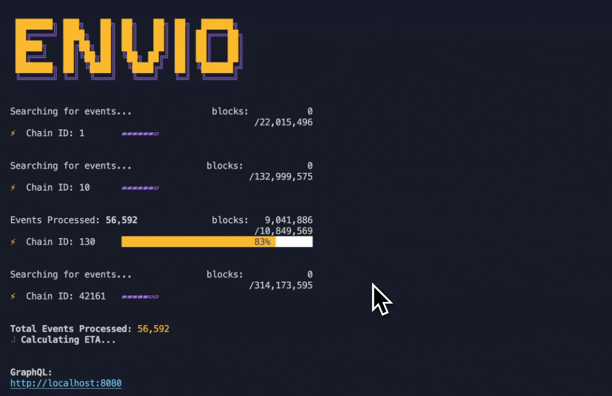

<Head>
  <meta name="og:image" content="/img/preview-banner.png" />
  <meta name="twitter:image" content="/img/preview-banner.png" />
</Head>

# HyperIndex: Fast Multichain Indexer

**HyperIndex** is a blazing-fast, developer-friendly multichain indexer, optimized for both local development and reliable hosted deployment. It empowers developers to effortlessly build robust backends for blockchain applications.

:::info HyperIndex & HyperSync

**HyperIndex** is Envio's full-featured blockchain indexing framework that transforms on-chain events into structured, queryable databases with GraphQL APIs.

**HyperSync** is the high-performance data engine that powers HyperIndex. It provides the raw blockchain data access layer, delivering up to 2000x faster performance than traditional RPC endpoints.

While HyperIndex gives you a complete indexing solution with schema management and event handling, HyperSync can be used directly for custom data pipelines and specialized applications.
:::

---

## Key Features

- **[Quickstart templates](/docs/HyperIndex/greeter-tutorial)** – Rapidly bootstrap your indexer.
- **[Real-time indexing](/docs/HyperIndex/latency-at-head)** – Instantly track blockchain events.
- **[Multichain indexing](/docs/HyperIndex/multichain-indexing)** – Supports multiple blockchains simultaneously.
- **[Local development](/docs/HyperIndex/running-locally)** – Full-featured local environment with Docker.
- **[Reorg support](/docs/HyperIndex/reorgs-support)** – Gracefully handles blockchain reorganizations.
- **[GraphQL API](/docs/HyperIndex/navigating-hasura)** – Easy-to-query indexed data.
- **[Cross-platform support](/docs/HyperIndex/supported-networks)** – Index any EVM-compatible blockchain and Fuel.
- **[High performance](/docs/HyperIndex/benchmarking)** – Historical backfills at over 5,000+ events per second.
- **[Indexer auto-generation](/docs/HyperIndex/contract-import)** – Generate indexers directly from smart contract addresses.
- **[Flexible language support](/docs/HyperIndex/terminology#programming-languages)** – JavaScript, TypeScript, and ReScript.
- **[Factory contract support](/docs/HyperIndex/dynamic-contracts)** – Index data from 100,000+ factory contracts seamlessly.
- **[On-chain & off-chain data integration](/docs/HyperIndex/contract-state)** – Easily combine multiple data sources.
- **[Self-hosted & managed options](/docs/HyperIndex/hosted-service)** – Run your own setup or use HyperIndex hosted services.
- **[Detailed logging & error reporting](/docs/HyperIndex/logging)** – Debug and optimize with clarity.
- **[External API actions](/docs/HyperIndex/ipfs)** – Trigger external services based on blockchain events.
- **[Wildcard topic indexing](/docs/HyperIndex/wildcard-indexing)** – Flexible indexing based on event topics.
- **[Fallback RPC data sources](/docs/HyperIndex/hypersync#improving-resilience-with-rpc-fallback)** – Enhanced reliability with RPC connections.

---

## Hypersync API Token Requirements

Starting from **21 May 2025**, HyperSync (the data engine powering HyperIndex) will implement rate limits for requests without API tokens. Here's what you need to know:

- **Local Development**: No API token is required for local development, though requests will be rate limited.
- **Self-Hosted Deployments**: API tokens are required for unlimited HyperSync access in self-hosted deployments. The token can be set via the `ENVIO_API_TOKEN` environment variable in your indexer configuration. This can be read from the `.env` file in the root of your HyperIndex project.
- **Hosted Service**: Indexers deployed to our hosted service will have special access that doesn't require a custom API token.
- **Free Usage**: The service remains free to use until mid-June 2025.
- **Future Pricing**: From mid-June 2025 onwards, we will introduce tiered packages based on usage. Credits are calculated based on comprehensive metrics including data bandwidth, disk read operations, and other resource utilization factors. For preferred introductory pricing based on your specific use case, reach out to us on [Discord](https://discord.gg/Q9qt8gZ2fX).

For more details about API tokens, including how to generate and implement them, see our [API Tokens documentation](/docs/HyperSync/api-tokens).

---

## Feature Roadmap

Upcoming features on our development roadmap:

- **⬜ RPC client with caching** – Improved indexing performance through cached RPC calls.

---

## 🔗 Quick Links

- [GitHub Repository](https://github.com/enviodev/hyperindex) ⭐
- [Join our Discord Community](https://discord.gg/Q9qt8gZ2fX)
