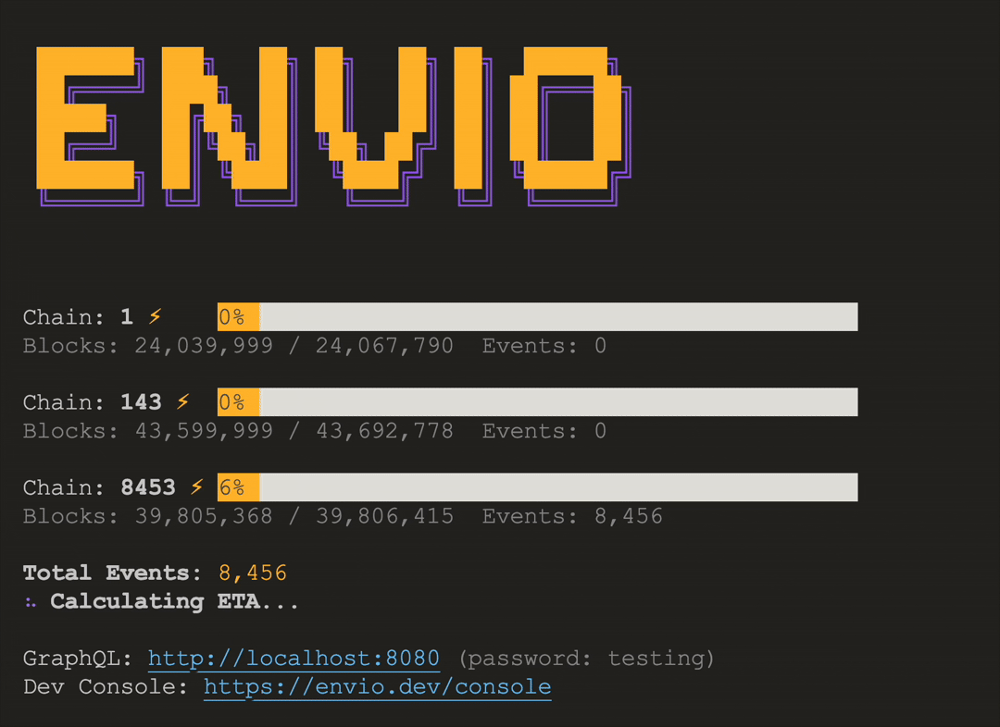

**HyperIndex** is a blazing-fast, developer-friendly multichain indexer, optimized for both local development and reliable hosted deployment. It empowers developers to effortlessly build robust backends for blockchain applications.

:::info HyperIndex & HyperSync

**HyperIndex** is Envio's full-featured blockchain indexing framework that transforms on-chain events into structured, queryable databases with GraphQL APIs.

[**HyperSync**](/docs/HyperSync/overview) is the high-performance data engine that powers HyperIndex. It provides the raw blockchain data access layer, delivering up to 2000x faster performance than traditional RPC endpoints.

While HyperIndex gives you a complete indexing solution with schema management and event handling, HyperSync can be used directly for custom data pipelines and specialized applications.
:::

---

## Key Features

- **[Quickstart templates](/docs/HyperIndex/greeter-tutorial)** – Rapidly bootstrap your indexer.
- **[Real-time indexing](/docs/HyperIndex/latency-at-head)** – Instantly track blockchain events.
- **[Multichain indexing](/docs/HyperIndex/multichain-indexing)** – Support multiple blockchains simultaneously.
- **[Local development](/docs/HyperIndex/running-locally)** – A full-featured local environment with Docker.
- **[Reorg support](/docs/HyperIndex/reorgs-support)** – Gracefully handle blockchain reorganizations without sacrificing latency.
- **[GraphQL API](/docs/HyperIndex/navigating-hasura)** – Easily query indexed data.
- **[Cross-platform support](/docs/HyperIndex/supported-networks)** – Index any EVM-, SVM-, or Fuel-compatible blockchain.
- **[High performance](/docs/HyperIndex/benchmarking)** – Perform historical backfills at 30,000+ events per second.
- **[Indexer auto-generation](/docs/HyperIndex/quickstart)** – Generate indexers directly from smart contract addresses.
- **[Flexible language support](/docs/HyperIndex/terminology#programming-languages)** – TypeScript, JavaScript, and ReScript.
- **[Factory contract support](/docs/HyperIndex/dynamic-contracts)** – Index data from over 1M dynamically registered contracts seamlessly.
- **[On-chain and off-chain data integration](/docs/HyperIndex/contract-state)** – Easily combine multiple data sources.
- **[Self-hosted and managed options](/docs/HyperIndex/hosted-service)** – Run your own setup or use Envio Cloud.
- **[Detailed logging and observability](/docs/HyperIndex/observability)** – Debug and optimize with clarity.
- **[External API actions](/docs/HyperIndex/ipfs)** – Trigger external services based on blockchain events.
- **[Wildcard topic indexing](/docs/HyperIndex/wildcard-indexing)** – Flexibly index based on event topics.
- **[Fallback RPC data sources](/docs/HyperIndex/rpc-sync#improving-resilience-with-rpc-fallback)** – Enhance reliability with RPC connections.

---

## Feature Roadmap

Upcoming features on our development roadmap:

- **Isolated Multichain Mode**
- **Polished Solana Support**
- **Indexing 1,000,000+ events per second**

---

## HyperSync API Token Requirements

HyperSync (the data engine powering HyperIndex) requires an API token for all requests. You can generate one in the [Envio Cloud portal](https://envio.dev/app/api-tokens). Here's what you need to know:

- **Local Development**: An API token is required. The CLI supports an automatic login flow to make this smoother.
- **Self-Hosted Deployments**: API tokens are required for HyperSync access in self-hosted deployments. Set the token via the `ENVIO_API_TOKEN` environment variable in your indexer configuration. This can be read from the `.env` file in the root of your HyperIndex project.
- **Envio Cloud**: Indexers deployed to Envio Cloud have special access that doesn't require a custom API token.
- **Pricing**: Tiered packages are available for those self-hosting HyperIndex and using HyperSync. See the [HyperSync pricing page](https://envio.dev/pricing/hypersync) for details, or reach out to us on [Discord](https://discord.gg/envio) for preferred pricing based on your specific use case.

For more details about API tokens, including how to generate and implement them, see our [API Tokens documentation](/docs/HyperSync/api-tokens).

---

## 🔗 Quick Links

- [GitHub Repository](https://github.com/enviodev/hyperindex) ⭐
- [Join our Discord Community](https://discord.gg/envio)
